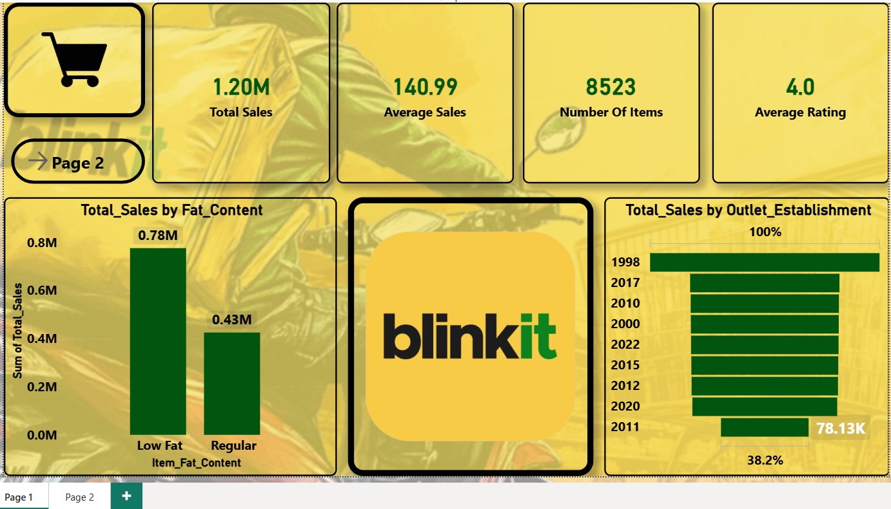
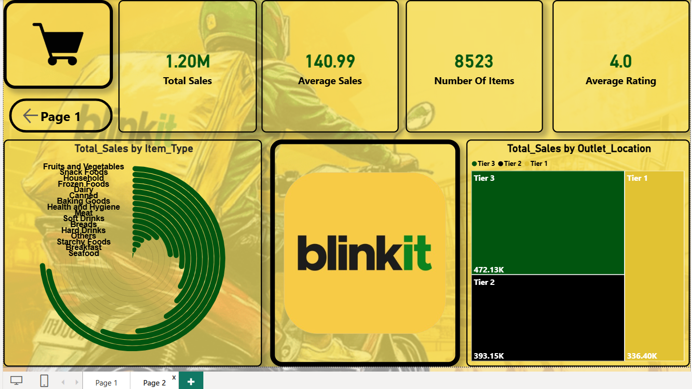

# BlinkIT Grocery Sales Analysis Dashboard

## Project Overview

This project analyzes BlinkIT grocery sales data using SQL, Power BI, and DAX.

The project focuses on analyzing sales performance across item types, fat content, outlet types, locations, and establishment years.

## Tools Used

- SQL
- Power BI
- DAX

## SQL Analysis

- Cleaned and standardized raw grocery sales data using SQL.
- Resolved inconsistent categorical values.
- Used aggregation queries to calculate key business KPIs.
- Used window function queries for analytical calculations.
- Calculated key metrics including:
  - Total Sales
  - Average Sales
  - Item Count
  - Average Rating

## Power BI Dashboard

Built a 2-page interactive Power BI dashboard using:

- KPI Cards
- Clustered Column Chart
- Funnel Chart
- Radial Bar Chart
- Treemap

The dashboard analyzes sales performance across:

- Item Types
- Fat Content
- Outlet Types
- Locations
- Establishment Years

## Key KPIs

- Total Sales
- Average Sales
- Number of Items
- Average Rating

## Project Files

- `blinkit_sales_analysis.sql` — SQL queries used for data cleaning and analysis.
- `blinkit_grocery_dashboard.pbix` — Power BI dashboard file.

- ## Key Insights

- Analyzed sales performance across different item types to identify higher- and lower-performing product categories.
- Compared total sales across outlet location tiers to evaluate location-based sales performance.
- Analyzed sales distribution across different product fat-content categories.
- Compared sales performance across different outlet establishment years.
- Tracked key business KPIs including total sales, average sales, number of items, and average rating.

## Dashboard Preview

### Page 1

### Page 2

